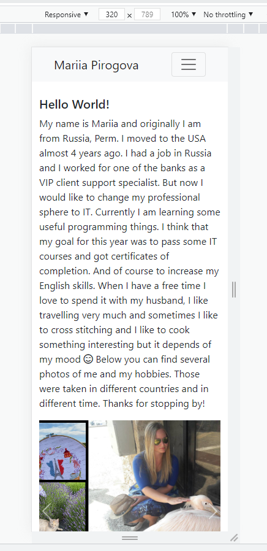
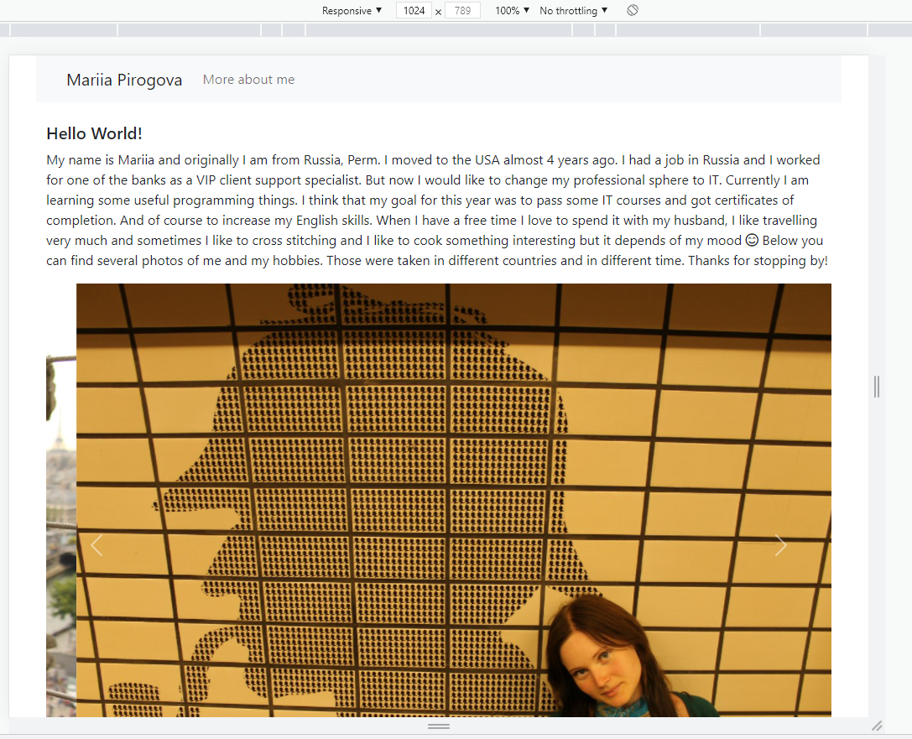

# Second page of my portfolio

Hello! My name is Mariia and in this project I created second page in my portfolio page where I continued use Bootstrap 5 framework. The both pages are responsive.

[Portfolio with Second page deployed version](https://maryvpie.github.io/port-second/)

## Screenshots and mockups of the second page

||  |
| --- | --- |
|  Mobile version | Laptop version |

## Links to Review

* The URL of the deployed application: https://maryvpie.github.io/port-second/

* The URL of the GitHub repository: https://github.com/MaryVPie/port-second

## From developer

Made with ❤️ by [MaryVPie](https://github.com/MaryVPie). I'm always happy to receive your feedback!

